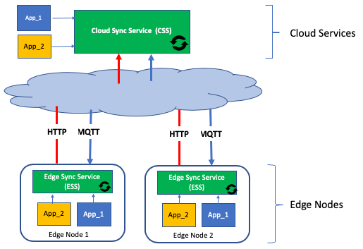

# edge-sync-service
Cloud - Edge synchronization service

## Overview
The sync service is a management tool for Edge Computing. 
It is designed to simplify applications that run on the edge by providing tools to synchronize objects between the cloud and the edge.  
Users of the sync service can create/update an object in the cloud and the object is then automatically propagated to the relevant edge nodes. 
Similarly, an object can be updated on the edge and delivered to the cloud. 
Example use cases include synchronization of configuration, rules and actions, user preferences, AI models, monitoring statistics, deployment files, and more.

### Sync service components
The sync service has two components:
1. Cloud Sync Service (CSS) running in the cloud. The CSS supports multi-tenants, high availability, and load balancing.
2. Edge Sync Service (ESS) running in edge nodes. Each ESS node has a Type and a unique ID.

The user application is also assumed to have an edge part and a cloud part.
The application interacts with the sync service (CSS and ESS) using REST calls.
Communication between the CSS and ESS nodes can be over MQTT or HTTP. 
The sync service is designed to work with the Watson IoT Platform and perform all communication through it.
Direct communication over HTTP/HTTPS or over an MQTT broker is also supported. 

The application provides the CSS/ESS an object that includes metadata, which defines the properties of the object, and optionally also binary data. 
The object's metadata includes the destinations for the object. The sync service supports flexibly addressing which allows an object to be sent from the CSS to:
1. A single ESS (using the ESS ID).
2. All ESS nodes of a certain Type.
3. Any group of ESS nodes.
4. All ESS nodes.

When an update for an object is received on the ESS/CSS the application is notified by the sync service. The application can then obtain and process the object.
Once the application is done processing the object it can mark it as consumed. The sync service allows users to view the delivery status of the object.  

### Sync service main features 
The following is a list of the main features provided by the sync service:
1. The Sync Service handles all communication aspects between cloud and edge  
    - Communication failures, edge nodes unavailable, limit on maximal message size, download resume, persistence accross restarts, and more.
2. Simple flexible control over objects
    - Create/Update/Read/Delete operations, version, persistence, expiration, activation time, delete on delivery, and more.
3. Flexible object distribution 
    - Dynamic addressing, write/read directly to/from file system (file transfer), use link to data, and more. 
4. Automatic synchronization when edge node re/starts
5. Tracking of delivery status
    - Provides an indication of the delivery status of an object for each of its destinations. 
6. Tracking of edge nodes
    - Allows users to view edge nodes
7. A security model that enables the control over who can create/update/read/delete which objects and to what edge nodes these objects can be sent to.
    - See the section [Security](#security)

## Development

### Prerequisites

1. Go 1.10 or above

### Setup

1. Create a Go "workspace" directory named for example edge-sync-service (can be named anything)
2. cd into the workspace directory
3. Run:
     1. `export GOPATH=$(pwd)`
     2. `go get -d github.com/open-horizon/edge-sync-service`
     3. `cd src/github.com/open-horizon/edge-sync-service`
     4. `go mod tidy`
     5. `go mod vendor`
     6. `./get_dependencies.sh`

### Build

To build the edge synch service, from the root of the workspace run:

1. `export GOPATH=$(pwd)` (if not already done)
2. `go install github.com/open-horizon/edge-sync-service/cmd/edge-sync-service`

To build the edge sync service container, from the root of the edge-sync-service repository run:

1. `export GOPATH=<workspace root>` (if not already done)
2. `./buildContainer.sh <platform>` (where platform is amd64, armhf, or arm64)

**Notes:**
1. The container will be tagged *open-horizon/edge-sync-service:latest*
2. To build a container for armhf (arm-32), you need to:
    1. Run the build script on a Linux box
    2. On the Linux box that you are going to run the build script run:
       1. `sudo apt-get install gcc-arm-linux-gnueabihf`
       2. `docker run --rm --privileged multiarch/qemu-user-static:register --reset`
3. To build a container for arm64, you need to:
    1. Run the build script on a Linux box
    2. On the Linux box that you are going to run the build script run:
       1. `sudo apt-get install gcc-aarch64-linux-gnu`
       2. `docker run --rm --privileged multiarch/qemu-user-static:register --reset`

### Running

#### Configuring

Setup a pair of configuration files or use environment variables. See sync.conf for an example configuration
file. All of the appropriate environment variable names are listed in the configuration file. The use
of a configuration file is **completely optional**. 

**Note:** If you are running both the cloud side and the edge side on the same box and are using environment variables
to configure them, make sure the file /etc/edge-sync-service/sync.conf does **NOT** exist.

##### SSL/TLS (access via HTTPS or connecting to broker via SSL/TLS)

The edge-sync-service when running on the "edge" will always only listen to requests using HTTPS. It automatically generates
it's own self signed certificate and key pair. The CA certificate is */var/edge-sync-service/persist/sync/certs/cert.pem*.

The edge-sync-service when running on the "cloud" can listen either as HTTPS or as HTTP depending on whether or not the
configuration properties **ServerCertificate** and **ServerKey** or the environment variables **SERVER_CERTIFICATE** and
**SERVER_KEY** were set to the file names of the server certificate-key pair.

To connect to a MQTT broker that is using TLS and the server certtificate is signed with a CA that
is not one of the well known CA's (i.e. self signed), you must provide the file containing the CA certificate using
the **MQTTCACertificate** configuration property or the **MQTT_CA_CERTIFICATE** environment variable.

#### As the Cloud Sync Service

To run the cloud side of the edge-sync-service:

1. `export GOPATH=<workspace root>` (if not already done)
2. In your configuration file make sure that *NodeType* is set to **CSS** or in the environment that
**NODE_TYPE** is set to CSS.
3. `$GOPATH/bin/edge-sync-service [-c <config file name>]`  (the -c option is only needed if you are using one)

To run the edge side of the edge-sync-service:

1. `export GOPATH=<workspace root>` (if not already done)
2. In your configuration file make sure that *NodeType* is set to **ESS** or in the environment that
**NODE_TYPE** is set to ESS.
3. `$GOPATH/bin/edge-sync-service [-c <config file name>]`  (the -c option is only needed if you are using one)

### Generate Swagger document

To generate the Swagger document for the Edge Synchronization Service you must:

1. Install go-swagger by running:
    1. `brew tap go-swagger/go-swagger`
    2. `brew install go-swagger`
2. From within your clone of the open-horizon/edge-sync-service repository, run:
    - `swagger generate spec -o ./swagger.json -m -b ./cmd/edge-sync-service`

**Note:** This will create an extra file in your clone of the repository. Do **NOT** commit the file.

### View the generated Swagger document

To view the generated Swagger document:
1. Run `$GOPATH/bin/edge-sync-service -swagger swagger.json`
2. Open your browser and go to `http://<host>:<port>/swagger`.

Where *&lt;host&gt;* and *&lt;port&gt;* are the host and port your edge-sync-service is configured to listen on.

### Samples

[Sending and receiving files](./samples/send-receive-files/README.md)

## Security
The Sync Service provides a secure infrastructure on which to synchronize objects from the cloud to the edge and from the edge to the cloud. It does this by typically requiring authentication and authorization to perform all tasks. Both objects and edge nodes, refered to as destinations, are protected when authentication is required.

### Sync Service Authentication

When authentication is required, all applications accessing the Sync Service via the Sync Service's RESTful API are required to provide an app key and app secret pair on all RESTful API calls.

  - Each client SDK has an appropriate language dependent API call to set the app key and app secret for use by the client "handle" when making the RESTful API calls to the Sync Service server the client handle is connecting to.
  - If one is not using one of the client SDKs and instead is making the RESTful API calls by one self, the app key and app secret must be sent as the username and password in a Basic Authorization header with each call.

Edge Sync Service instances are also typically required to identify themselves when communicating with a Cloud Sync Service instance.

The exact form of the app key and app secret pair is dependent on how the Sync Service instance one is communicating with has been configured. The app key and app secret pair are used to determine and validate the user's identity. The user's identity includes their username, the organization they are part of, and the type of user they are. A user can be an organization admin, a regular user, or an edge node.

It should be noted that one can set up the Sync Service to not require authentication at all.
The default setup, while requiring authentication, makes most users organization admins.
Such a setup should **not** be used in a production setting.

### Sync Service Authorization

The Sync Service protects objects by limiting access to object types. In addition it protects edge nodes by limiting access to destination types.

#### Application Authorization

In order for an application to create, read, update, or delete an object in the Sync Service, it must have access to the object type of the object in question. The application does this by:

1. Having authenticated with a user identity that is an organization admin in the object's organization.
2. Having authenticated as a regular user, who's username is on an access control list for the object type in question.
3. The access control list for the object type in question has been marked publically accessible.

In addition for an application to create an object on a Cloud Sync Service, it must have access to all of the destination types mentioned in the object's metadata. The application does this by:

1. Having authenticated with a user identity that is an organization admin in the object's organization.
2. Having authenticated as a regular user, who's username is on access control lists for the destination types in question.
3. The access control lists for the destination types in question have been marked publically accessible.

#### Edge Node Authorization

Sync Service instances running on Edge Nodes identify themselves when they communicate with Cloud Sync Service instances. This is done to prevent an Edge Sync Service instance from masquerading as some other destination.
The user identity used for an Edge Sync Service instance can be any one of the user identity types supported by the Sync Service. In particular, if the user identity is of:

1. An edge node, the identity must match the destination type and destination ID of the Edge Sync Service instance.
2. An organization admin, it must be an admin of the organization the edge node is part of.
3. A regular user, that user's username must be on an access control list for the destination type of the Edge Sync Service instance.

### Access Control Lists

Access control lists (ACLs) are used by the Sync Service to grant regular users both read and write access to object types and destination types within an organization. Users who are organization admins can add and remove users from ACLs. An ACL is automatically created when the first user's username is added to the ACL in question. An ACL is automatically deleted when the last user's username is removed from the ACL in question. Adding a username of asterisk (*) to an ACL allows any and all authenticated users within the organization access to object type or destination type in question.

ACLs are maintained using the appropriate Sync Service RESTful APIs. All of the Sync Service client SDKs provide language dependent APIs for these RESTful APIs.
