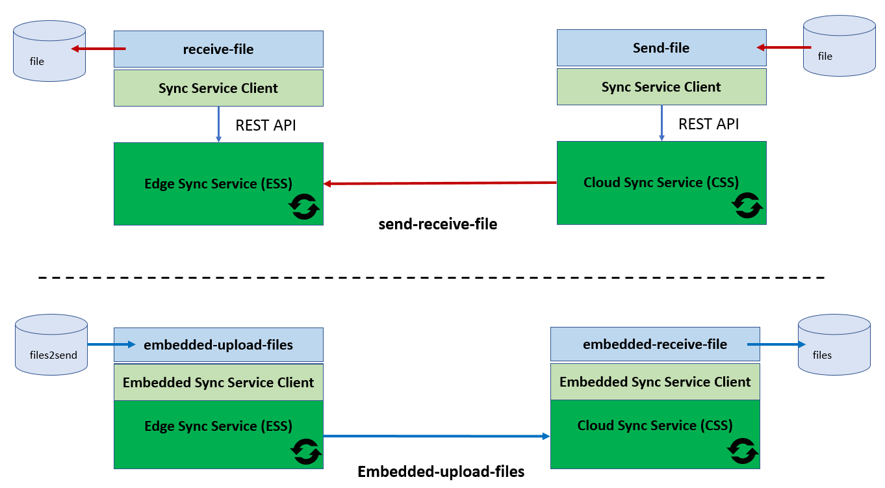

# Sync Service samples: send and receive files between the cloud and the edge

There are two samples, send-receive-file and upload-files. Each sample includes a pair of executables and configuration files.  
The samples are built using the [edge-sync-service-client SDK for Go](https://github.com/open-horizon/edge-sync-service-client), which provides an easy-to-use interface to the Sync Service APIs, avoiding the need to work with the Sync Service RESTful APIs. 
Instructions are first provided on how to run the samples on a single machine. This is followed by instructions on how to use the samples in more realistic scenarios where different processes run on different machines.

1. The [send-receive-file](./send-receive-file.md) sample demonstrates how to send a single file from the cloud to the edge or from the edge to the cloud.   
The sample uses the standard Sync Service setup where the CSS and ESS each run as a service in a dedicated process. The send-file and receive-file applications use the Sync Service client to interact with the Sync Service (CSS or ESS). 

2. The [embedded-upload-files](./embedded-upload-files.md) sample demonstrates how to upload files from the edge to the cloud. Files are constantly read from a source directory on the edge, transferred to the cloud, and stored in a destination directory. 
The sample uses the embedded Sync Service setup where the application, the Sync Service embedded client and the Sync Service (CSS or ESS) all run in the same process. 

The figure below shows the setup of the two samples.   

